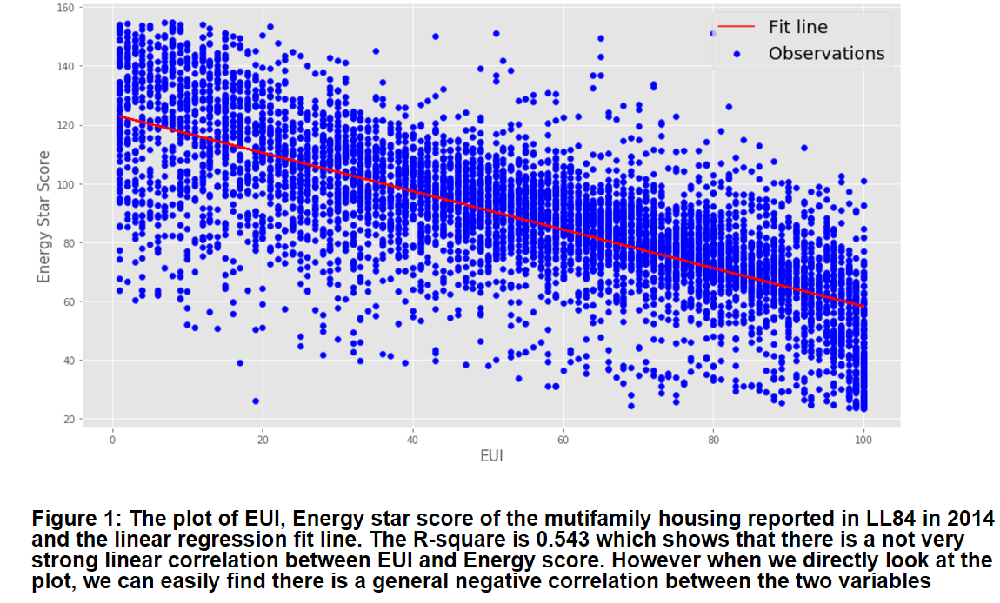

Review by Cheng Ma (cm4692)

**CLARITY**  
Thanks for the description and red-blue color. It is not hard to get the points Chenrui wants to show. 
However, there are something to improve for Chenrui in my mind.
1. The plot needs a title.
2. The labels should show units to let us know what EUI is. Given that the plot may be showed to some freshman of urban science.
3. I am wondering if the upper limatation of EUI is 100 units.
 
**AESTHETHIC**  
I think the blue points and red line camparable clearly. So we can get the information at the first time. But the color of labels is a little shallow. The size of x-y labels could be larger than it is now.

**HONESTY**  
I think Chenrui honestly get the conclusion from the datasets. We can get some hypothesis that the outliers of EUI may be the cause of lower R^2 from his description below the plot.
